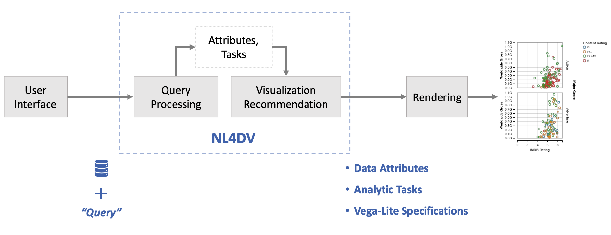

# NL4DV

**NL4DV** stands for **N**atural **L**anguage toolkit **for** **D**ata **V**isualization. It takes a **natural language query** about a given **dataset** as input and outputs a **structured JSON object** containing:
* Data attributes, 
* Analytic tasks, and
* Visualizations (Vega-Lite specifications)



The preprint of the **Research Paper** due to appear at **IEEE VIS'20** can be downloaded from [here](https://arxiv.org/abs/2008.10723).

The **Documentation**, **Usage**, and **Examples** can be found [here](https://nl4dv.github.io/nl4dv/).

### Credits
NL4DV was created by 
<a target="_blank" href="https://www.cc.gatech.edu/~anarechania3">Arpit Narechania</a>, <a target="_blank" href="https://arjun010.github.io/">Arjun Srinivasan</a>, and <a href="https://www.cc.gatech.edu/~john.stasko/">John Stasko</a> of the <a target="_blank" href="http://vis.gatech.edu/">Georgia Tech Visualization Lab>.

We thank <a href="mailto:rmitra34@gatech.edu">Rishab Mitra</a> for helping build some of our debugger applications and members of the <a target="_blank" href="http://vis.gatech.edu/">Georgia Tech Visualization Lab</a> for their support and constructive feedback.</p>

<!--## Citation-->
<!--```bibTex-->
<!--@article{narechania2020nl4dv,-->
  <!--title={NL4DV: A Toolkit for Generating Analytic Specifications for Data Visualization from Natural Language Queries},-->
  <!--author={Narechania, Arpit and Srinivasan, Arjun and Stasko, John},-->
  <!--journal={arXiv preprint arXiv:2008.10723},-->
  <!--year={2020}-->
<!--}-->
<!--```-->

### License
The software is available under the [MIT License](https://github.com/nl4dv/nl4dv/blob/master/LICENSE).

### Contact
If you have any questions, feel free to [open an issue](https://github.com/nl4dv/nl4dv/issues/new/choose) or contact [Arpit Narechania](https://www.cc.gatech.edu/~anarechania3).
