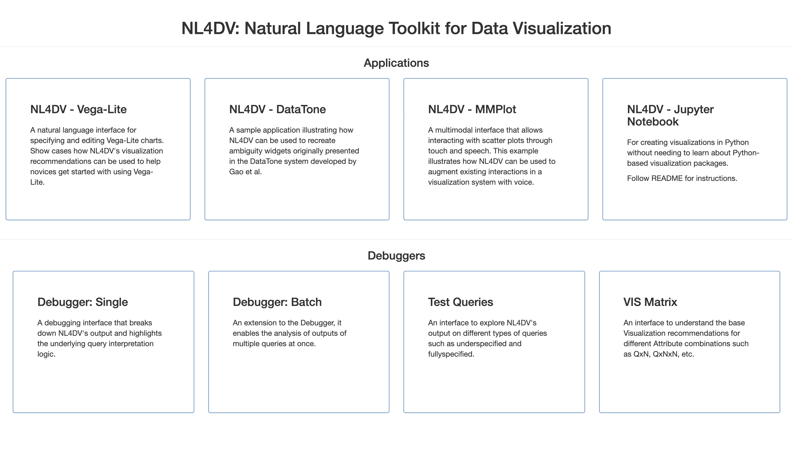

# Running the Examples (and Debuggers)



- Once NL4DV is installed, run ```pip install -r requirements.txt``` from within the **Examples** folder to install all dependencies for example applications (only required the first time).

- ```python app.py```

- You can access the three example applications at http://localhost:7001/. 

---
### Application Overview: Natural Language Interface to Vega-Lite
---


With this application, users can enter Vega-Lite specifications in the left panel and click "Run" to render the corresponding visualization. Alternatively, users who are unfamiliar with the Vega-Lite syntax can type in natural langauge queries into the input box at the top of the page and click "Execute" to generate a Vega-Lite specification corresponding to the input query. Additionally, the system also suggests alternative visualizations that may be relevant to the entered query as thumbnails at the bottom of the page. Clicking these thumbnails displays the chart and its corresponding specification on the left. Note that if a specification is manually edited, the recommended visualizations at the bottom of the screen get removed but the previous query remains in the input box for easier reference.

---
### Application Overview: DataTone's Ambiguity Widgets
---


This application is inspired by the [DataTone system](http://www.cond.org/datatone.html) developed by Gao et al. Once a natural language query is entered via the input box at the top of the screen, in addition to a visualization, the system highlights ambiguities in the input query through options in a dropdown menu. Clicking through these options helps the system "resolve" ambiguities and present more relevant visualizations. Note that this example does not replicate all of DataTone's features and focuses on highlighting data attribute- and value-level ambiguities.  

---
### Application Overview: MMPlot
---


MMPlot is a multimodal scatterplot visualization system that allows creating and interacting with scatterplots using direct manipulation (through mouse or touch) and voice. Supported direct manipulation interactions include changing x, y, color, and size attributes using axis and legend dropdown menus, filtering using the control panel on the right (collapsed by default), zoom/pan, and tapping on individual points to see their details. Instead of performing repeated actions with mouse or touch, users can leverage voice to specify charts, apply filter, or do both through a single query.
